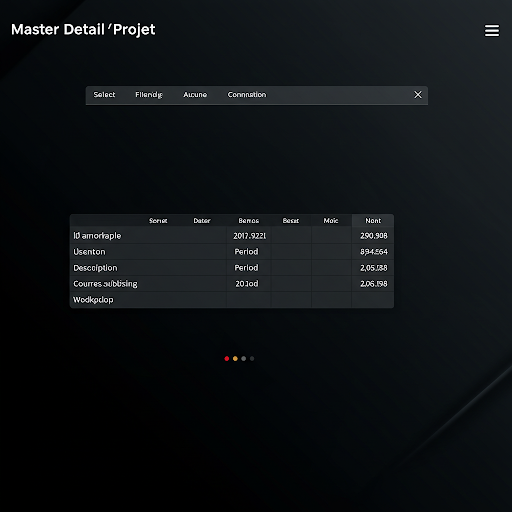

# Master Detail

<div align="center">


<div data-badges>
 
 
 
 

</div>

<div data-badges>
 
 
 
 
</div>

</div>

## Descrição do Projeto:

O projeto `master_detail` é uma aplicação frontend construída com o framework Next.js, utilizando Tailwind CSS para estilização e TypeScript para garantir a tipagem estática do código. Seu principal objetivo é consumir os dados da API [college_api](https://github.com/Pablo-Sts/college_api) e apresentá-los de forma organizada e interativa para o usuário.

## Funcionalidades Principais:

- Listagem de Disciplinas: A aplicação exibe uma lista de disciplinas em um componente select, permitindo que o usuário escolha uma disciplina específica.
- Tabela de Matérias: Ao selecionar uma disciplina, a aplicação exibe uma tabela com os dados das matérias relacionadas a essa disciplina, consumindo os dados da API college_api.
- Interface Intuitiva: A aplicação possui uma interface limpa e intuitiva, facilitando a navegação e a compreensão dos dados.

## Tecnologias Utilizadas:

- Next.js: Um framework React para construção de aplicações web com renderização do lado do servidor (SSR) e geração de sites estáticos (SSG).
- Tailwind CSS: Um framework CSS utilitário que permite estilizar a interface de forma rápida e eficiente.
- TypeScript: Uma linguagem de programação que adiciona tipagem estática ao JavaScript, melhorando a segurança e a manutenibilidade do código.

##  Objetivo do Projeto:

O projeto `master_detail` foi desenvolvido como requisito para a disciplina de Programação III, com o objetivo de demonstrar os conhecimentos adquiridos em desenvolvimento de aplicações frontend com Next.js, consumo de APIs e estilização com Tailwind CSS. A aplicação serve como um exemplo prático de como construir uma interface para exibir dados de uma API, atendendo às necessidades de um sistema de gerenciamento acadêmico.


## Como rodar esse projeto

### Requisitos

- Node.js instalado

### Execução

1. Clone esse repositório

    ```sh
    git clone https://github.com/Pablo-Sts/master_detail
    ```

2. Acesse o diretório do projeto: 

    ```sh
    cd master_detail
    ```

3. Copie as variáveis de ambiente listads e crie um arquivo `.env` e preencha com as seguintes informações:

    ```sh
     NEXT_PUBLIC_API =
    ```

5. Instale as dependênciads do projeto com o comando `npm i`.

6. Abra um terminal na pasta do projeto e execute o comando `npm run dev` para executar o projeto.

## Preview




## Links úteis

- [Next JS](https://nextjs.org/)
- [Tailwind CSS](https://tailwindcss.com/)